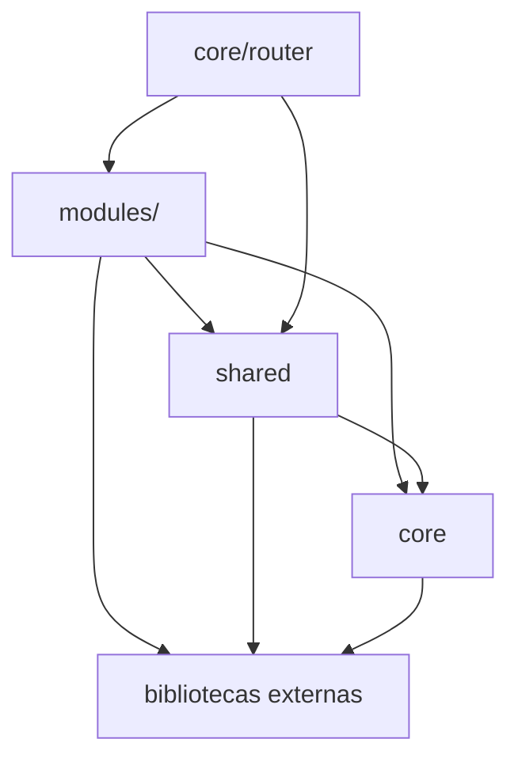

# AgentsNovo.md - Diretrizes Genericas de Engenharia e Arquitetura

Este documento estabelece diretrizes reutilizaveis para um frontend web moderno e, quando aplicavel, para o backend que o atende. Ele serve como referencia para desenvolvedores humanos, agentes autonomos de IA, geradores de codigo e automacoes de CI/CD.

A estrutura abaixo e uma base. Substitua os placeholders entre `<` e `>` pelos contratos do produto que adotar estas diretrizes.

---

## 1. Visao Geral da Arquitetura

O sistema pode ser organizado como um monorepo com camadas independentes:

```text
<project-root>/
├── backend/                  # API, regras de negocio, persistencia e testes
└── frontend/                 # SPA, componentes, modulos e infraestrutura de UI
    ├── src/
    │   ├── core/             # HTTP, router, stores, i18n e registries
    │   ├── modules/          # fatias verticais de dominio
    │   └── shared/           # UI, hooks, helpers, services e tipos comuns
    ├── docs/                 # arquitetura, governanca e guias operacionais
    └── scripts/              # geradores e automacoes locais
```

### Fluxo geral do frontend

```text
main.tsx
  -> App.tsx
    -> Providers globais
      -> Router
        -> RouteGuard + AppLayout
          -> Route
            -> Page do modulo
              -> Hook/Container
                -> Service
                  -> Request Helper
                    -> Cliente HTTP
                      -> API
```

O router e o ponto de composicao da aplicacao. A pagina compoe a tela, hooks coordenam estado e efeitos, services conhecem contratos HTTP e componentes compartilhados nao conhecem regras de negocio.

### Principios de dependencia

As dependencias devem fluir para baixo:



| Camada | Responsabilidade | Pode importar | Nao deve importar |
|---|---|---|---|
| `modules/<feature>` | UI e casos de uso de um dominio | `shared`, `core`, bibliotecas externas | outro modulo diretamente |
| `shared` | UI, contratos e comportamentos reutilizaveis | `core`, bibliotecas externas | `modules` |
| `core` | infraestrutura e composicao da aplicacao | bibliotecas externas e tipos proprios | `modules` e `shared` em geral |
| `core/router` | wiring das rotas e do shell | `modules` e `shared` | regras de negocio |

O router e uma excecao de composicao deliberada. Outras partes de `core` nao devem passar a depender de modulos de dominio.

Quando dois modulos precisam da mesma capacidade, siga esta ordem:

1. extraia um tipo, helper ou service sem dominio para `shared`;
2. crie uma camada de agregacao se o comportamento combinar varios dominios;
3. mantenha uma excecao documentada somente quando a extracao prejudicar o contrato.

---

## 2. Principios SOLID Aplicados

### S - Single Responsibility Principle

Cada classe, modulo, componente ou funcao deve ter apenas um motivo para mudar.

- Arquivos de rotas apenas declaram rotas e associam componentes.
- Pages apenas compoem a tela.
- Hooks coordenam estado, efeitos e chamadas necessarias.
- Services apenas implementam comunicacao com a API e mapeamento de dados.
- Schemas apenas definem validacao.
- Forms apenas renderizam campos, estados e erros.
- Componentes de UI compartilhados apenas renderizam comportamento visual generico.
- Stores globais apenas administram estado realmente transversal.

### O - Open/Closed Principle

Novas funcionalidades devem ser adicionadas por extensao, sem alterar componentes centrais ja estabilizados.

- Use registries para descobrir rotas, menus ou plugins quando isso reduzir acoplamento.
- Use configuracao e composicao para novos comportamentos.
- Evite condicoes especificas de um dominio dentro de componentes compartilhados.

### L - Liskov Substitution Principle

Componentes e hooks base devem aceitar contratos tipados uniformes e continuar substituiveis entre modulos.

- Uma tabela base deve funcionar com qualquer linha que respeite seu contrato.
- Um dialog de formulario deve funcionar com qualquer formulario que respeite suas props.
- Um hook generico de listagem deve aceitar services compativeis com sua interface.

### I - Interface Segregation Principle

Nenhum consumidor deve depender de metodos ou campos que nao utiliza.

- Separe tipos de listagem, detalhe e payload.
- Use props pequenas e orientadas ao comportamento.
- Divida services grandes em operacoes coerentes.

### D - Dependency Inversion Principle

Modulos de alto nivel devem depender de abstracoes, nao de detalhes de infraestrutura.

- Pages usam hooks e services, nao instanciam o cliente HTTP.
- Services usam um request helper, nao configuram interceptors individualmente.
- Componentes usam callbacks e contratos tipados, nao conhecem stores de dominio sem necessidade.

---

## 3. Design Patterns e Arquitetura

### 3.1. Backend opcional: Request-Service-Repository

Quando houver backend, uma pipeline comum e:

```text
Requisicao HTTP
  -> Rota
    -> Middleware
      -> Request/Schema
        -> Controller
          -> Service/Use Case
            -> Repository ou Model
              -> Resource/DTO
                -> Resposta JSON
```

Regras recomendadas:

1. validacao deve ocorrer antes da regra de negocio;
2. Controllers devem orquestrar, nao concentrar regras complexas;
3. Services ou use cases devem ser donos da transacao;
4. respostas devem usar Resources ou DTOs, nunca expor modelos crus sem decisao explicita;
5. regras de autorizacao devem ser verificaveis e independentes da UI.

### 3.2. Frontend: Vertical Slices

Cada dominio de negocio reside em `src/modules/<feature>/` e possui isolamento suficiente para evoluir independentemente.

```text
src/modules/<feature>/
├── components/              # componentes visuais especificos
├── containers/              # composicao de secoes e estados complexos
├── forms/                   # formularios, se o projeto separar esta pasta
├── hooks/                   # hooks de consulta, mutacao e coordenacao
├── schemas/                 # validacao de entradas
├── services/                # comunicacao com a API
├── types/                   # contratos API, UI e payloads
├── <Feature>ListingPage.tsx
├── <Feature>DetailPage.tsx ou <Feature>DetailSheet.tsx
└── .context.md              # contexto local do modulo
```

### Regras fundamentais do frontend

1. **Sem imports cross-module por padrao:** `src/modules/X` nao importa `src/modules/Y`. Promova o que for realmente compartilhado para `shared` ou crie uma camada de agregacao documentada.
2. **Cliente HTTP centralizado:** pages e services de modulo usam `requestHelper<T>` ou equivalente. Chamadas de baixo nivel ficam isoladas no cliente e em excecoes documentadas, como upload binario.
3. **Listagens padronizadas:** tabelas paginadas, pesquisaveis ou filtraveis usam um hook compartilhado como `useListing`.
4. **Validacao na fronteira:** dados de formularios e entradas externas passam por schemas tipados antes de serem enviados ao backend.
5. **Mapeamento explicito:** se o modelo da API for diferente do modelo da UI, a conversao fica no service ou em um mapper nomeado.

---

## 4. SHIELD - Seguranca, Defesa e Resiliencia

### 4.1. Toda entrada e nao confiavel

- Payloads, query params, headers, arquivos e dados de terceiros sao nao confiaveis por padrao.
- Valide entradas no frontend para experiencia do usuario e no backend para seguranca real.
- Nunca confie apenas na validacao do navegador.
- Limite tamanho, formato, cardinalidade e frequencia de entradas conforme o risco.

### 4.2. Autenticacao e autorizacao

- Defina claramente quais rotas sao publicas e quais exigem sessao.
- Centralize a politica de autenticacao no cliente HTTP ou em um provider.
- Trate `401`, `403`, expiracao e renovacao de sessao de forma distinta.
- Nao coloque regras de permissao somente na UI.
- Prefira cookies `httpOnly` e `secure` para sessoes quando o modelo da aplicacao permitir.
- Nunca grave senhas, chaves privadas, tokens de acesso ou segredos no codigo-fonte.

### 4.3. Uploads seguros

Para arquivos, prefira um fluxo controlado:

1. o frontend solicita uma intencao de upload;
2. o backend valida permissao, tamanho, extensao e MIME;
3. o frontend envia o binario para uma URL pre-assinada isolada;
4. o frontend envia o identificador do objeto no payload do dominio;
5. o backend valida e confirma a vinculacao.

Isole o transporte binario em um service compartilhado. Nao espalhe chamadas diretas ao storage por pages e formularios.

### 4.4. Fail-fast e erros barulhentos

- Erros inesperados nao devem ser ignorados.
- Falhas devem ser registradas com contexto suficiente, sem expor dados sensiveis.
- O cliente deve distinguir erros de validacao, autorizacao, rede, cancelamento e falhas inesperadas.
- Mensagens exibidas ao usuario devem ser seguras e internacionalizaveis.
- Stack traces e detalhes internos nunca devem ser expostos em producao.

Um contrato de erro generico pode conter:

```json
{
  "message": "Mensagem segura para o consumidor",
  "errors": {
    "field": ["Mensagem de validacao"]
  },
  "request_id": "id-opcional-de-rastreio"
}
```

---

## 5. Convencoes de Codigo e Clean Code

### 5.1. Regra do leitor sem contexto

Escreva codigo para uma pessoa que precisara corrigir um problema em producao sem conhecer a decisao original.

- Prefira simplicidade a truques sintaticos.
- Use nomes que expressem intencao, nao mecanismo.
- Use guard clauses para erros e pre-condicoes.
- Mantenha o caminho feliz legivel.
- Use comentarios somente para explicar o porquê de uma decisao nao obvia.
- Nao deixe comportamento importante escondido em efeitos colaterais inesperados.

### 5.2. Naming conventions

| Elemento | Convencao recomendada |
|---|---|
| Classes, interfaces e types | `PascalCase` |
| Funcoes, metodos e variaveis | `camelCase` |
| Constantes | `UPPER_SNAKE_CASE` quando forem realmente constantes |
| Componentes React | `PascalCase.tsx` |
| Hooks | `use` + `PascalCase` |
| Schemas | `<feature>.schema.ts` |
| Services | `<feature>.service.ts` |
| Types | `<feature>.type.ts` |
| Rotas | `<feature>.route.tsx` |
| Arquivos genericos | `kebab-case` |
| Payloads da API | convencao definida pelo contrato da API |
| Modelos de UI | convencao consistente com o TypeScript |

Nao use nomes de dominio genericos demais, como `data`, `item`, `value` ou `handleThing`, quando um nome contextual for possivel.

### 5.3. Imports e aliases

- Use o alias de paths definido pelo projeto.
- Evite caminhos relativos longos.
- Ordene imports conforme a configuracao do formatter ou linter.
- Nao importe um modulo inteiro quando uma exportacao especifica for suficiente.

---

## 6. Git, Versionamento e Governanca

### 6.1. Conventional Commits

Quando o projeto adotar Conventional Commits, use:

- `feat: <descricao curta>` - nova funcionalidade;
- `fix: <descricao curta>` - correcao de comportamento;
- `refactor: <descricao curta>` - refatoracao sem mudanca de comportamento;
- `test: <descricao curta>` - testes;
- `docs: <descricao curta>` - documentacao;
- `chore: <descricao curta>` - manutencao, build ou dependencias.

### 6.2. Regra de ouro para agentes e automacoes

> Nunca execute `git commit`, `git push`, `git reset`, `git checkout`, remocao em massa ou troca de branch sem autorizacao explicita do desenvolvedor no turno atual.

Preserve alteracoes existentes de outros autores. Antes de editar, verifique o estado do workspace e nao reverta mudancas que nao foram feitas pelo agente.

### 6.3. Manutencao de contexto

- Toda alteracao estrutural deve atualizar a documentacao de contexto correspondente.
- Toda funcionalidade visivel ao usuario deve atualizar o mapa ou catalogo de funcionalidades do projeto.
- Decisoes arquiteturais e excecoes devem ser registradas em uma pagina de decisoes.
- Documentacao deve descrever o comportamento real, nao apenas a intencao original.

---

## 7. Desenvolvimento e Scaffolding

### Pre-requisitos

Documente as versoes suportadas de:

- runtime, como Node.js, Deno ou Bun;
- gerenciador de pacotes;
- framework de UI;
- banco e backend, quando aplicavel;
- ferramentas de teste, lint e formatacao.

### Comandos oficiais

O projeto deve possuir comandos claros para:

```bash
# instalar dependencias
<package-manager> install

# iniciar desenvolvimento
<package-manager> run dev

# validar tipos
<package-manager> run typecheck

# executar lint
<package-manager> run lint

# executar formatacao
<package-manager> run format

# criar build de producao
<package-manager> run build

# executar testes
<package-manager> run test
```

Substitua os placeholders pelos comandos reais e mantenha-os documentados no README e no CI.

### Gerador de modulos

Um scaffolder pode criar o boilerplate de `src/modules/<feature>/`, mas deve:

- validar o nome e os argumentos;
- informar os arquivos que serao criados;
- evitar sobrescrever arquivos sem confirmacao;
- ser idempotente quando possivel;
- gerar rotas, menu e traducoes conforme os registries adotados;
- deixar TODOs claros para campos e endpoints especificos;
- retornar codigo de erro diferente de zero em caso de falha.

O gerador e uma conveniencia. Ele nao substitui a compreensao dos contratos do modulo.

---

## 8. Instrucoes para Desenvolvedores

### Ao criar uma nova funcionalidade

1. confirme o contrato da API e o nome singular do dominio;
2. localize um modulo existente pequeno e bem mantido para usar como referencia;
3. crie ou gere a estrutura do modulo;
4. implemente types, schema, service, hooks, forms e componentes;
5. registre a rota e o item de menu, quando necessario;
6. adicione traducoes para todos os locales suportados;
7. trate loading, erro, vazio, cancelamento e sucesso;
8. atualize o contexto do modulo e a documentacao de funcionalidades;
9. execute typecheck, lint, build e testes relevantes.

### Ao corrigir um bug

Comece pelo fluxo que produz o comportamento: rota, page, hook, service ou componente base. Identifique o ponto de controle antes de alterar codigo.

Para chamadas assincronas, verifique:

- se requisicoes antigas podem sobrescrever dados novos;
- se ha cancelamento no desmontar ou trocar de parametro;
- se erros de cancelamento nao sao exibidos como falhas;
- se loading e estado vazio sao distintos;
- se a UI continua consistente apos retry ou reload.

### Ao alterar uma abstracao compartilhada

- procure todos os consumidores antes de modificar o contrato;
- preserve compatibilidade quando possivel;
- atualize tipos e documentacao junto com a mudanca;
- adicione ou ajuste testes de contrato;
- valide pelo menos um modulo consumidor real.

### Checklist do desenvolvedor

- [ ] a funcionalidade esta na camada correta;
- [ ] nao existe import cross-module desnecessario;
- [ ] entradas sao validadas;
- [ ] erros e cancelamentos sao tratados;
- [ ] API e UI possuem modelos bem definidos;
- [ ] textos visiveis estao internacionalizados;
- [ ] acessibilidade basica foi preservada;
- [ ] typecheck, lint, build e testes foram executados;
- [ ] a documentacao foi atualizada;
- [ ] nenhuma operacao Git destrutiva foi feita sem autorizacao.

---

## 9. Instrucoes para Agentes de IA

Estas regras devem ser consideradas obrigatorias por agentes que exploram, revisam, geram ou alteram codigo.

### 9.1. Antes de editar

1. leia as instrucoes locais do repositorio;
2. leia a documentacao de arquitetura e o contexto do modulo afetado;
3. localize o arquivo que decide o comportamento, nao apenas o arquivo que o encaminha;
4. leia uma implementacao vizinha que represente o mesmo padrao;
5. confirme as fronteiras de dependencia entre `core`, `shared` e `modules`;
6. verifique o estado do workspace e preserve mudancas existentes;
7. formule uma hipotese local e uma verificacao barata que possa refuta-la;
8. escolha a menor edicao que permita testar a hipotese.

Nao faca uma exploracao ampla do repositorio quando uma rota, hook, service, componente ou teste vizinho resolver a duvida.

### 9.2. Durante a edicao

- preserve arquivos e alteracoes de outros autores;
- mantenha a edicao focada no comportamento solicitado;
- siga o padrao local mais proximo e confiavel;
- use helpers existentes para HTTP, validacao, listagem, i18n e estado;
- respeite registries automaticos quando o projeto os adotar;
- nao crie arrays ou pontos de registro paralelos sem necessidade;
- nao introduza abstracoes apenas para reduzir poucas linhas;
- promova codigo para `shared` somente quando houver reutilizacao real;
- atualize tipos, traducoes e documentacao quando o contrato mudar;
- nao adicione comentarios que apenas descrevem o codigo;
- nao inclua segredos, credenciais ou dados reais em arquivos ou logs.

### 9.3. Depois da edicao

1. execute primeiro a validacao mais estreita disponivel para o slice alterado;
2. se houver um teste especifico, execute-o antes da suite completa;
3. rode typecheck, lint, build e testes conforme o impacto da mudanca;
4. se uma validacao falhar, corrija o mesmo slice e repita o comando;
5. verifique imports, rotas, menu, traducoes e contratos quando aplicavel;
6. revise o diff para detectar alteracoes acidentais;
7. relate o que foi validado e qualquer lacuna;
8. nao faca commit, push, reset destrutivo ou troca de branch automaticamente.

### 9.4. Regras para automacoes

- comandos destrutivos exigem autorizacao explicita;
- geradores devem validar entradas antes de escrever arquivos;
- geradores devem falhar antes de sobrescrever arquivos existentes, salvo confirmacao;
- operacoes em lote devem oferecer modo de simulacao quando possivel;
- scripts devem retornar codigo diferente de zero em falhas;
- mensagens de erro devem indicar causa e proxima acao;
- automacoes devem ser deterministicas e revisaveis por diff;
- logs nao devem conter segredos ou dados pessoais desnecessarios;
- dependencias novas exigem justificativa e validacao de compatibilidade;
- nenhum script deve publicar, fazer deploy ou alterar infraestrutura sem autorizacao.

### 9.5. Checklist de revisao do agente

- [ ] a mudanca foi feita no ponto que controla o comportamento;
- [ ] a dependencia entre camadas continua valida;
- [ ] nao houve import cross-module novo sem justificativa;
- [ ] estados de loading, erro, cancelamento e vazio continuam tratados;
- [ ] entradas e payloads permanecem validados;
- [ ] resposta da API e modelo de UI continuam compativeis;
- [ ] traducoes e acessibilidade foram consideradas;
- [ ] rotas e menu usam o mecanismo de registro correto;
- [ ] typecheck, lint, build e testes foram executados ou a impossibilidade foi registrada;
- [ ] documentacao e contexto acompanham a alteracao;
- [ ] nao houve operacao destrutiva ou publicacao sem autorizacao.

---

## 10. Decisoes que Cada Projeto Deve Documentar

Ao adotar esta base, crie uma pagina de decisoes ou um arquivo de contexto contendo:

- limites entre camadas e excecoes permitidas;
- contrato do cliente HTTP e formato dos erros;
- estrategia de autenticacao e armazenamento de sessao;
- convencao de rotas, menu e breadcrumbs;
- formato de um modulo de referencia;
- estrategia de i18n, tema e acessibilidade;
- comandos oficiais de desenvolvimento e CI;
- cobertura e limites da suite de testes;
- regras de seguranca para uploads, logs e dados sensiveis;
- politica de versionamento e revisao de dependencias;
- estrategia de observabilidade, monitoramento e rollback.

Uma arquitetura replicavel nao depende apenas de pastas. Ela depende de contratos explicitos, fronteiras verificaveis, validacoes automatizadas e um modulo pequeno que demonstre o caminho completo.

---

_Documento base para adaptacao. Substitua os placeholders e registre as excecoes especificas do projeto que o utilizar._
