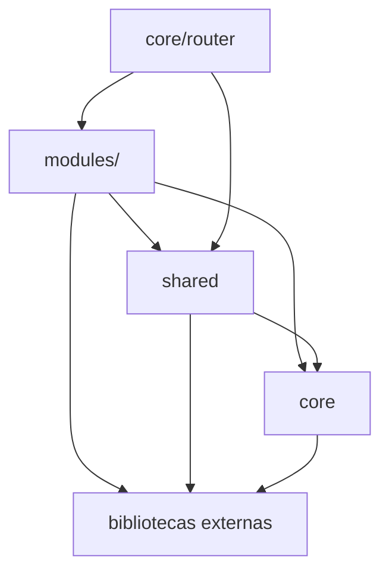

# Arquitetura Base de um Frontend Modular

Este documento descreve uma base de arquitetura para uma SPA React com TypeScript. O objetivo e oferecer uma referencia replicavel em outros produtos, preservando as fronteiras entre infraestrutura, componentes reutilizaveis e fatias verticais de dominio.

Os nomes entre `<` e `>` sao placeholders. Substitua-os pelos contratos, dominios e convencoes do projeto que adotar esta estrutura.

## 1. Visao geral

A arquitetura combina:

- **fatias verticais de dominio** em `src/modules/`;
- **infraestrutura da aplicacao** em `src/core/`;
- **componentes, hooks, servicos e tipos reutilizaveis** em `src/shared/`;
- **dados locais e recursos de suporte** em `src/mock/` ou em uma pasta equivalente.

O fluxo de runtime recomendado e:

```text
main.tsx
  -> App.tsx
    -> RouterProvider
      -> router
        -> RouteGuard + AppLayout
          -> route file
            -> page do modulo
              -> hook/container
                -> service do modulo
                  -> request helper
                    -> cliente HTTP
```

O router e o ponto de composicao. A pagina compoe a tela; hooks coordenam estado e efeitos; services conhecem os endpoints; componentes compartilhados nao conhecem regras de dominio.

## 2. Estrutura de diretorios

```text
src/
├── main.tsx                 # inicializacao da aplicacao
├── App.tsx                  # providers globais e notificacoes
├── index.css                # tokens, reset e estilos globais
├── App.css                  # estilos especificos do shell, quando aplicavel
├── assets/                  # imagens e recursos estaticos
├── core/
│   ├── http/                # cliente HTTP, request helper e erros
│   ├── i18n/                # instancia e carregamento de traducoes
│   ├── menu/                # tipos, itens e registry da navegacao
│   ├── router/              # shell, tipos, rotas e registry
│   └── store/               # estado global realmente transversal
├── modules/
│   └── <feature>/           # uma fatia vertical por dominio
├── shared/
│   ├── components/          # UI, layouts, base e componentes de navegacao
│   ├── helpers/             # formatacao e serializacao sem dominio
│   ├── hooks/               # abstracoes de fluxo reutilizaveis
│   ├── services/            # servicos compartilhados
│   └── types/               # contratos comuns da API e da UI
└── mock/                    # dados locais, fixtures ou traducoes
```

### 2.1. Camadas e dependencias

A direcao padrao das dependencias e:



| Camada | Responsabilidade | Pode importar | Nao deve importar |
|---|---|---|---|
| `modules/<feature>` | UI e casos de uso de um dominio | `shared`, `core`, bibliotecas externas | outro modulo diretamente |
| `shared` | contratos e UI reutilizaveis, sem dominio | `core`, bibliotecas externas | `modules` |
| `core` | infraestrutura e composicao da aplicacao | bibliotecas externas e tipos proprios | `modules`, `shared` em geral |
| `core/router` | wiring das rotas e do shell | `modules` e `shared` | regras de negocio |

O router e uma excecao deliberada: arquivos de rota importam paginas dos modulos e o shell importa o guard de autenticacao e o layout. Outras partes de `core` nao devem copiar essa excecao.

Quando dois modulos precisam da mesma capacidade, prefira:

1. extrair um tipo, helper ou servico sem dominio para `shared`;
2. criar uma camada de agregacao explicita quando o comportamento combinar dominios;
3. manter uma excecao documentada somente quando a extracao piorar o contrato.

Dependencias entre modulos devem ser tratadas como excecoes visiveis, com justificativa e plano de extracao quando houver acoplamento crescente.

## 3. Entry points e shell

- `src/main.tsx` importa estilos e infraestrutura inicial, e monta `App` em `StrictMode`.
- `src/App.tsx` monta o router e providers globais, como notificacoes.
- `src/core/router/index.tsx` cria o browser router, agrupa rotas protegidas, declara rotas publicas e possui a rota de fallback.
- `src/shared/components/layouts/AppLayout.tsx` compoe navegacao, header e outlet da pagina.

Decida explicitamente se as paginas serao carregadas de forma eager ou com code splitting. A escolha deve ser uniforme e documentada no projeto.

## 4. Rotas e navegacao

### Rotas

Cada rota deve ser um arquivo `src/core/router/routes/<feature>.route.tsx` com `default export` compativel com `RouteObject`. Um registry pode descobrir esses arquivos automaticamente com `import.meta.glob` ou mecanismo equivalente.

O contrato opcional de `handle` pode suportar:

- `breadcrumb`: chave de traducao para o breadcrumb;
- `dynamicBreadcrumb`: indica que a pagina atualiza o titulo dinamicamente.

Nao replique o guard de autenticacao ou o layout dentro de cada modulo. A composicao deve ocorrer uma unica vez no shell.

### Menu

Uma navegacao baseada em arquivos pode seguir esta convencao:

- arquivo direto em `items/`: item de topo;
- pasta `items/<group>/`: grupo de dominio;
- `<group>/_group.menu.ts`: metadados do grupo;
- `order`: ordenacao, com desempate estavel pelo nome do arquivo;
- `key` duplicada: falha de validacao ou aviso explicito do registry.

O layout deve consumir uma arvore de menu pronta. Um novo item deve ser adicionado declarando seu arquivo, icone, rota, ordem e traducoes, sem editar o componente da sidebar.

## 5. Modulos de dominio

Um modulo deve ser nomeado no singular e seguir, quando aplicavel, esta estrutura:

```text
src/modules/<feature>/
├── <Feature>ListingPage.tsx
├── <Feature>DetailPage.tsx ou <Feature>DetailSheet.tsx
├── components/
│   ├── <Feature>CreateForm.tsx
│   └── <Feature>EditForm.tsx
├── containers/              # secoes de detalhe e composicao de tela
├── hooks/
│   ├── use<Feature>.ts      # listagem e acoes da tabela
│   ├── use<Feature>Create.ts
│   ├── use<Feature>Edit.ts
│   ├── use<Feature>Detail.ts
│   └── use<Feature>FormOptions.ts
├── schemas/<feature>.schema.ts
├── services/<feature>.service.ts
├── types/<feature>.type.ts
└── .context.md
```

Responsabilidades:

- **Page:** composicao da tela, layout e passagem de callbacks.
- **Hook:** estado, ciclo de vida, cancelamento e coordenacao de services.
- **Service:** endpoint, parametros, payload e mapeamento API para UI.
- **Schema:** validacao de entrada e mensagens internacionalizadas.
- **Form:** campos, estados visuais e erros do formulario.
- **Container:** apresentacao de secoes de detalhe ou composicao de blocos.
- **Type:** contratos separados para resposta da API, linha e detalhe.

### Fluxo CRUD recomendado

```text
ListingPage
  -> use<Feature>
    -> useListing
      -> fetch<Feature>s
        -> request helper
          -> API

Create/Edit Form
  -> schema
    -> hook de mutacao
      -> service
        -> request helper
          -> reload / notificacao
```

Para listagens paginadas com busca, filtros ou ordenacao, use um hook compartilhado como `useListing`. O contrato do service deve receber um filtro tipado e devolver uma resposta tipada com dados e metadados de pagina.

O hook de listagem deve centralizar, quando aplicavel:

- pagina atual;
- busca submetida;
- filtros e ordenacao;
- loading, erro e estado vazio;
- cancelamento de requisicoes antigas;
- reload;
- retorno para a primeira pagina quando filtros mudarem.

Detalhes podem ser uma rota `/:id` ou um Sheet sobre a listagem. Use Sheet quando a consulta deve preservar o contexto da lista; use rota quando o detalhe for uma tela navegavel e indexavel.

## 6. Contratos transversais

### HTTP

Centralize chamadas de API em um request helper. Ele deve:

- aceitar os metodos HTTP usados pelo produto;
- retornar o corpo de resposta em um tipo generico;
- normalizar falhas de transporte e de API em um erro conhecido;
- preservar erros de validacao por campo;
- distinguir cancelamento de falha real.

O cliente HTTP deve concentrar URL base, timeout, headers comuns, autenticacao, observabilidade e politica de resposta `401`. Services de modulo nao devem importar o cliente de baixo nivel diretamente.

### Uploads

Quando arquivos forem enviados, prefira um fluxo separado para objetos grandes:

1. solicitar ao backend uma intencao de upload;
2. validar permissao, tamanho, extensao e MIME;
3. transferir o binario para uma URL pre-assinada sem headers de autenticacao indevidos;
4. enviar o identificador do upload no payload do dominio;
5. confirmar a vinculacao no backend.

Isole essa excecao em um servico compartilhado. Nao espalhe `multipart/form-data` ou chamadas binarias por todos os modulos.

### Estado

Use store global somente para estado transversal, como tema, idioma, sessao ou preferencias. Estado de pagina, formulario, busca e detalhe deve permanecer no modulo ou no hook compartilhado apropriado.

Cada store deve declarar explicitamente:

- estado inicial;
- persistencia, se existir;
- efeitos colaterais;
- estrategia de hidratacao;
- comportamento em falha.

### Internacionalizacao

Escolha uma estrategia unica: imports explicitos ou descoberta automatica dos arquivos de traducao. Em ambos os casos:

- separe traducoes por modulo e contexto;
- mantenha os locales suportados documentados;
- valide chaves ausentes no CI quando possivel;
- nao use texto de dominio hard-coded na UI.

### Tema e estilos

Defina tokens de tema em CSS e conecte-os ao sistema de componentes. Componentes base devem usar tokens, nao cores especificas de um dominio. A estrategia de tema, como classe no elemento raiz ou media query, deve ser centralizada em um store ou provider.

## 7. Como replicar em outro projeto

Antes de transportar a estrutura, defina os contratos variaveis:

- framework e versoes suportadas;
- endpoint base e formato de erro da API;
- autenticacao, renovacao de sessao e politica de `401`;
- locales e estrategia de traducoes;
- dominios, grupos e paths do menu;
- fluxo de upload e provedor de objetos;
- tokens CSS e identidade visual;
- formato de paginacao, ordenacao e filtros;
- estrategia de testes, logs e monitoramento;
- politica de carregamento eager ou lazy.

Ordem recomendada de adaptacao:

1. alinhar contratos HTTP, autenticacao e tipos comuns;
2. configurar entrypoint, providers, tema e router;
3. adaptar menu e layout aos dominios do novo produto;
4. criar um modulo CRUD pequeno como referencia;
5. configurar testes e validacoes automatizadas;
6. replicar novos modulos a partir desse exemplo;
7. remover qualquer dependencia, mock ou texto herdado que nao pertença ao novo produto.

Um scaffolder e opcional. Ele deve gerar arquivos, mas nao deve esconder os contratos arquiteturais nem exigir edicao manual de listas centrais quando a descoberta automatica for adotada.

## 8. Instrucoes para desenvolvedores

### Ao criar uma funcionalidade

1. confirme o contrato da API e o nome singular do dominio;
2. crie ou gere o modulo com a estrutura padrao;
3. ajuste types, schema, forms, hooks e service;
4. registre a rota e o item de menu, quando necessario;
5. adicione traducoes para todos os locales;
6. documente o contexto do modulo e o comportamento visivel ao usuario;
7. execute lint, build e os testes do slice.

### Ao corrigir um bug

Comece pelo fluxo que produz o comportamento: rota, page, hook, service ou componente base. Preserve o contrato publico dos helpers compartilhados e corrija a causa no ponto de controle. Para chamadas assincronas, considere cancelamento, estados de loading, erro, vazio e desmontagem do componente.

### Regras de qualidade

- use o alias de paths definido pelo projeto;
- evite imports cross-module; prefira extracao para `shared`;
- mantenha modelos da API separados dos modelos de apresentacao;
- padronize nomes de payload e mappers;
- nao armazene segredos no codigo-fonte;
- nao execute commit ou push sem autorizacao explicita;
- mantenha documentacao e codigo sincronizados;
- trate mocks como suporte de desenvolvimento, nunca como cobertura automatizada.

## 9. Instrucoes para agentes de IA e automacao

Estas regras orientam agentes que exploram, alteram, geram ou revisam o frontend.

### Antes de editar

1. leia as instrucoes locais do repositorio e este documento;
2. localize o arquivo que decide o comportamento e um modulo vizinho equivalente;
3. confirme a regra de dependencia da camada;
4. formule uma hipotese local sobre a causa e uma verificacao barata que possa refuta-la;
5. verifique o estado do workspace e preserve alteracoes de outros autores;
6. edite somente depois de identificar o ponto de controle.

Evite mapear o repositorio inteiro quando uma rota, hook, service ou componente proximo resolve a duvida.

### Durante a edicao ou geracao

- faca a menor mudanca que testa a hipotese;
- siga o padrao do modulo vizinho mais simples e bem mantido;
- respeite as fronteiras entre `core`, `shared` e `modules`;
- use os helpers existentes para HTTP, listagem, validacao e i18n;
- nao edite arrays centrais se o projeto adota registries por descoberta;
- nao introduza abstracoes sem uma duplicacao ou fronteira concreta que elas resolvam;
- atualize documentacao estrutural ao criar ou mover arquivos;
- nao adicione comentarios que apenas narrem o codigo;
- nunca altere, remova ou reverta mudancas de terceiros sem autorizacao.

### Depois da edicao

1. execute primeiro a validacao mais estreita disponivel para o slice alterado;
2. rode lint, typecheck, build e testes relevantes conforme o impacto da mudanca;
3. se uma validacao falhar, corrija o mesmo slice e repita o comando antes de expandir a investigacao;
4. verifique traducoes, rotas, menu e imports quando a mudanca atravessar esses registries;
5. relate claramente o que foi validado e qualquer lacuna;
6. nunca faca commit, push, reset destrutivo ou alteracao de branch automaticamente.

### Regras para automacoes

- comandos destrutivos exigem autorizacao explicita;
- geradores devem ser idempotentes ou falhar antes de sobrescrever arquivos;
- scripts devem validar argumentos e informar o que sera criado ou alterado;
- operacoes em lote devem oferecer modo de simulacao quando possivel;
- falhas devem retornar codigo diferente de zero e mensagem acionavel;
- automacoes nao devem inserir segredos em arquivos, logs ou mensagens;
- toda alteracao automatica deve ser revisavel por diff.

### Checklist de revisao do agente

- [ ] a dependencia entre camadas continua valida;
- [ ] nao houve import cross-module novo sem justificativa;
- [ ] estados de loading, erro, cancelamento e vazio continuam tratados;
- [ ] payload e resposta permanecem compativeis com a API;
- [ ] traducoes existem para todos os locales;
- [ ] rotas e menu usam o mecanismo de registro correto;
- [ ] lint, build e testes foram executados ou a impossibilidade foi registrada;
- [ ] a documentacao acompanha a alteracao;
- [ ] nenhuma operacao destrutiva ou publicacao foi executada sem autorizacao.

## 10. Decisoes que devem ser documentadas por cada projeto

Ao adotar esta base, crie uma pagina de decisoes ou um arquivo de contexto contendo:

- limites entre camadas e excecoes permitidas;
- contrato do cliente HTTP e formato dos erros;
- estrategia de autenticacao e armazenamento da sessao;
- convencao de rotas e menu;
- formato de um modulo de referencia;
- estrategia de i18n, tema e acessibilidade;
- comandos oficiais de desenvolvimento e CI;
- cobertura e limites da suite de testes;
- regras de seguranca para uploads, logs e dados sensiveis.

Uma arquitetura replicavel nao depende apenas de pastas: depende de contratos explicitos, validacoes automatizadas e um exemplo pequeno que demonstre o caminho feliz completo.
